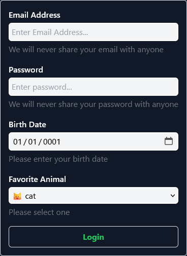

---
title: Getting started
---

# Getting started

## Add the package

You can use the `dotnet add` to add the QuickForm package to your project.

```bash
dotnet add package QuickForm
```

---

## Import the namespace

Import the `QuickForm.Components` namespace in your `_Imports.razor` or component / page file.

!!! info "Importing namespaces for customization"

    If you plan to [customize](../customization) the form, you will also need to import the following namespaces

    - `QuickForm.Attributes`
    - `System.ComponentModel`
    - `System.ComponentModel.DataAnnotations` 

``` csharp title="_Imports.razor"
@using QuickForm.Components
@using QuickForm.Attributes
@using System.ComponentModel
@using System.ComponentModel.DataAnnotations
```

---

## Choose your components

QuickForm comes with two default implementations to get you started:

- `TwQuickForm<TEntity>` - A form component that uses **TailwindCSS** classes for styling
- `BsQuickForm<TEntity>` - A form component that uses **Bootstrap** classes for styling

!!! info "Customization"

    if you wish to customize the form to suit your own needs, see [Customization](../customization)

???+ example "Preview of the components"

    This is what the components **could** look like, depending on the one you choose.

    The tailwind version has dark mode support and hover effects.

    Keep in mind you can always [customize](../customization) and create a custom form, for your specific needs.
    
    === "Tailwind"

        { loading=lazy }

    === "Bootstrap"
    
        { loading=lazy }

---

## Create your model

```csharp
public class Person
{
    public string Name { get; set; }
    public int Age { get; set; }
}
```

---

## Decorate your model

Here are some of the most common and basic attributes you can use to customize and flavor the generated form

- `[Required]` - Marks a property as required
- `[DisplayName]` - Changes the display name of a property - **label text**
- `[Description]` - Adds a description to the input - **text below the input**
- `[Placeholder]` - Adds a placeholder to the input - **text inside the input**
- `[Range]` - Adds a range validation to the input

```csharp
public class Person
{
    [Required]
    [Description("We will never disclose your personal details with third parties.")]
    public string Name { get; set; }
    
    [Required]
    [DisplayName("Your age")]
    [Range(18, 100)]
    public int Age { get; set; }
}
```

!!! info "Attributes"

    For a list of all available attributes, see [Attributes](../attributes)

---

## Create the form

=== "Tailwind"

    ``` jsx
    <TwQuickForm Model="@Person" OnValidSubmit="@HandleValidSubmit" />
    ```
    ```csharp
    @code 
    {
        private Person Person = new Person();

        private void HandleValidSubmit()
        {
            // Do something with the form data
        }
    }
    ```

=== "Bootstrap"

    ``` jsx
    <BsQuickForm Model="@Person" OnValidSubmit="@HandleValidSubmit" />
    ```
    ```csharp
    @code 
    {
        private Person Person = new Person();

        private void HandleValidSubmit()
        {
            // Do something with the form data
        }
    }
    ```

---


## Congratulations!

You now have a fully functional form with validation and submit handling.

=== "Tailwind"

    { loading=lazy }

=== "Bootstrap"

    { loading=lazy }

---


## Next steps

<div class="grid cards" markdown>

- :material-format-font: [Create a __custom__ form](../customization)
- :material-format-font: [Check out the attributes](../attributes)

</div>